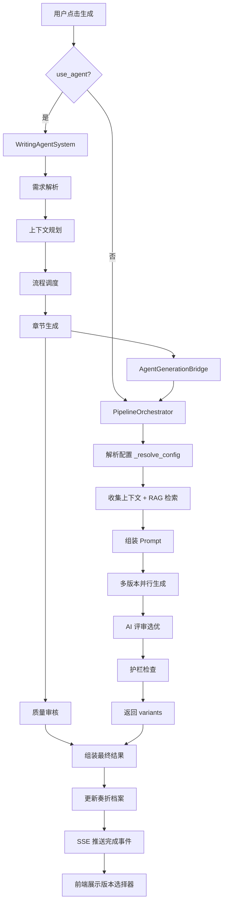
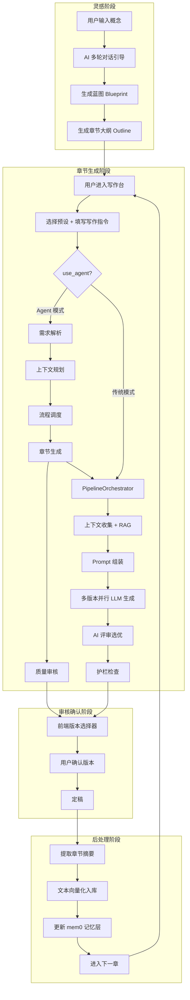

# 小说写作系统完整架构文档 v1.0

> **Arboris-Novel** — AI 辅助小说创作平台，通过服务化生成流水线与可选自创先进多 Agent 架构，实现从灵感到成稿的全链路闭环。

---

## 中央控制中心（Core Control Hub）

**中央控制中心**是整个系统的调度枢纽，在代码中由 `HybridExecutor` + `WritingAgentSystem` + `PipelineOrchestrator` 三层协同实现。它不是一个单独的类，而是一个由三个组件共同构成的调度协议层。

### 核心职责

| 职责 | 实现组件 | 说明 |
|------|---------|------|
| **模式路由** | `HybridExecutor` | 根据 `use_agent` 标志决定走 Agent 系统还是传统流水线 |
| **Agent 编排** | `WritingAgentSystem` | 按序调度五个 Agent，通过返回值传递上下文 |
| **流水线执行** | `PipelineOrchestrator` | 执行 RAG 检索、上下文组装、多版本生成、审核评分的完整流水线 |
| **全局状态管理** | `WritingArchiveService`（奏折系统） | 记录每次生成任务的完整工作流、耗时、阶段产物 |
| **质量把控** | `GatekeeperReviewService` + `SixDimensionReviewService` | 多层审核把关，不合格可触发重写 |
| **实时反馈** | `stream_handler` 回调链 | 从后端生成阶段事件 → SSE 推送 → 前端 AgentFlowVisualizer 实时渲染 |

### 输入/输出接口

```
输入:
  project_id: str          — 小说项目 ID
  chapter_number: int       — 目标章节号
  writing_notes: str        — 用户写作指令（可选）
  flow_config: Dict         — 流水线配置（preset、版本数、各模块开关）
  stream_handler: Callable  — SSE 事件回调

输出:
  variants: List[Dict]      — 生成的多个版本（content + metadata）
  best_version_index: int   — AI 推荐的最佳版本索引
  review_summaries: Dict    — 各审核模块的评分汇总
  debug_metadata: Dict      — 调试信息（阶段耗时、RAG 命中率等）
  archive_id: int           — 奏折档案 ID
```

### 调度流程（伪代码）

```python
class CentralControlHub:
    """概念伪代码 — 实际分布在 HybridExecutor + WritingAgentSystem 中"""

    async def execute(self, request: GenerateRequest) -> GenerateResult:
        # 1. 路由决策
        if request.flow_config.use_agent:
            return await self._agent_path(request)
        else:
            return await self._pipeline_path(request)

    async def _agent_path(self, request):
        # 需求解析 → 上下文规划 → 流程调度 → 章节生成 → 质量审核
        system = WritingAgentSystem(session, archive_service)
        return await system.execute_chapter_generation(
            project_id=request.project_id,
            chapter_number=request.chapter_number,
            config=request.flow_config,          # 完整配置透传
            user_id=request.user_id,
            stream_handler=request.stream_handler,
        )
        # 生成智能体内部通过 AgentGenerationBridge 调用 PipelineOrchestrator
        # 实现 Agent 架构与传统流水线能力的无缝融合

    async def _pipeline_path(self, request):
        orchestrator = PipelineOrchestrator(session)
        return await orchestrator.generate_chapter(
            project_id=request.project_id,
            chapter_number=request.chapter_number,
            user_id=request.user_id,
            flow_config=request.flow_config,
            stream_handler=request.stream_handler,
        )
```

### 解耦与耦合策略

- **与下游模块解耦**：每个 Agent 只接收 `AgentContext`（Pydantic 模型），不直接引用其他 Agent 的类；服务层通过 `AsyncSession` 注入，无全局状态
- **与下游模块强耦合**：Agent 的 `process()` 返回值格式由 `AgentResult` 严格约定；`PipelineOrchestrator` 的返回值格式（`variants` / `review_summaries` / `debug_metadata`）被所有下游消费者依赖

### 调度流程图



---

## 系统总览与设计哲学

### 项目目标

Arboris-Novel 的目标是构建一个**从灵感到成稿的全链路 AI 写作平台**，覆盖网文、文学小说、轻小说等多种类型。核心定位不是"AI 代写"，而是"AI 协作"——系统提供上下文管理、质量审核、风格对齐等能力，让人类作者聚焦于创意本身。

### 核心价值

1. **上下文不丢失**：通过 RAG 向量检索 + mem0 记忆层，确保第 100 章仍能引用第 3 章埋下的伏笔
2. **多版本择优**：每次生成 1-3 个版本，AI 评审打分后推荐最佳版本，人类做最终决策
3. **风格可控**：Writer Persona 系统让 AI 模仿特定写手风格，包括口头禅、句式节奏、感官偏好
4. **质量有底线**：GatekeeperReview 护栏 + 六维度审核 + 宪法合规检查，多层防护

### 技术栈

| 层 | 技术 |
|----|------|
| 后端框架 | Python 3.11 + FastAPI + SQLAlchemy（全异步） |
| 前端框架 | Vue 3 + TypeScript + Naive UI + TailwindCSS 4 |
| 数据库 | MySQL 8.0+（asyncmy 驱动） |
| 向量数据库 | Qdrant（RAG 分块/摘要 + mem0 记忆层），可选 BM25 混合检索 |
| LLM 接口 | OpenAI 兼容 API（支持自定义 base_url，可接入 Gemini/Claude/DeepSeek 等） |
| 实时通信 | Server-Sent Events（SSE） |

---

## 模块详解

### 1. 灵感模式（Inspiration Engine）

**定义**：通过多轮 AI 对话，从一句模糊的想法逐步引导出完整的小说蓝图（世界观、角色、大纲）。

**关键文件**：
- 前端：`frontend/src/views/InspirationMode.vue`
- 后端：`backend/app/api/routers/novels.py`（`/conversations` 端点）
- Prompt：`backend/prompts/concept.md`

**输入**：
- 用户的初始概念描述（一句话或短段落）
- 参考小说（可选，最多 3 本，系统从库中检索并融合风格特征）
- 创作禁区（用户希望 AI 避免的内容）

**处理流程**：
1. 用户输入概念 → 系统创建项目（`NovelProject`）
2. AI 发起引导对话，逐步确认：世界观类型、主角特质、核心冲突、叙事视角
3. 每轮对话返回 `UIControl`（控制前端显示哪些输入选项）
4. 当 AI 判断信息充足（`is_complete=true`）→ 触发蓝图生成
5. 蓝图包含：标题、类型、风格、世界观设定、角色列表、角色关系、章节大纲

**输出**：`Blueprint` 对象（JSON），包含 `title`、`genre`、`world_setting`、`characters`、`relationships`、`chapter_outline[]`

**与中央控制中心的交互**：灵感模式独立于生成流水线运行，其产出（Blueprint）被存储到数据库，后续章节生成时由 `ChapterContextService` 读取并注入到 Prompt 上下文中。

**关键参数**：
- `max_conversation_rounds`：最大对话轮数（默认 10）
- `reference_novel_count`：参考小说数量上限（3）

**可扩展性**：可接入外部知识库（如起点排行榜数据）来丰富 AI 的类型建议；可增加"风格模仿"模式，直接从参考小说中提取叙事结构。

**实际案例片段**：
```
用户：我想写一个修仙世界里，一个废材逆袭的故事
AI：这是一个经典的"废材逆袭"题材。让我帮你细化几个关键维度：
    1. 你的修仙世界是"仙侠"还是"玄幻"体系？
    2. 主角的"废材"体现在哪里——是灵根差还是出身低？
    3. 逆袭的核心驱动力是什么——奇遇、血脉觉醒、还是纯粹努力？
```

---

### 2. 章节大纲生成（Outline Architect）

**定义**：基于蓝图自动生成每章的结构化大纲，包含章节功能定位、情感弧线、伏笔操作等元数据。

**关键文件**：
- 模型：`backend/app/models/chapter_blueprint.py`
- 服务：`backend/app/services/blueprint_service.py`
- Prompt：`backend/prompts/chapter_plan.md`、`backend/prompts/chapter_plan_lite.md`

**输入**：蓝图（Blueprint）+ 已生成章节的摘要 + 用户指令（可选）

**处理流程**：
1. 读取蓝图中的故事主线和角色设定
2. 基于当前进度计算章节定位（开篇/发展/高潮/收尾）
3. 调用 LLM 生成结构化大纲（JSON 格式）
4. 写入 `chapter_blueprints` 表

**输出**：每章 `ChapterBlueprint` 包含：
- `brief_summary`：一句话概括
- `chapter_function`：progression / turning / revelation / climax / resolution
- `emotional_arc`：情感走向
- `suspense_density`：悬念密度（compact / gradual / explosive / relaxed）
- `foreshadowing_ops`：伏笔操作（plant / reinforce / payoff / none）
- `cognitive_twist_level`：认知颠覆等级（1-5）
- `director_script`：导演脚本（详细的章节指导）
- `beat_sheet`：节拍表

**与中央控制中心的交互**：大纲数据在章节生成时由 `PipelineOrchestrator` 的上下文收集阶段读取，注入到 Writing Prompt 中作为章节目标约束。

**关键参数**：`pacing_model`（default / strand_weave），strand_weave 模式下启用**线团节奏系统**——将情节线分为 quest（任务线 60%）、fire（冲突线 25%）、constellation（关系线 15%）三类交织。

---

### 3. 章节推演（Chapter Simulation & Deduction）

**定义**：在正式生成前，对章节大纲进行逻辑推演，检验角色行为合理性、时间线一致性、因果链完整性。

**关键文件**：
- `backend/app/services/consistency_service.py`
- `backend/app/agents/generation_bridge.py`（`AgentConsistencyChecker`）
- `backend/app/services/memory_layer_service.py`

**输入**：章节大纲 + 前序章节状态（角色属性、时间线、未回收伏笔）

**处理流程**：
1. **角色状态检查**：从 `MemoryLayerService` 读取角色当前属性（修为、位置、持有物），检查大纲中的行为是否违反已确立的设定
2. **时间线校验**：检查大纲中的事件是否与已发生事件存在时间矛盾
3. **境界跳跃检查**：如果大纲涉及角色突破，检查跨度是否合理（如从"练气"直接到"元婴"则告警）
4. **伏笔提醒**：列出已埋下 3 章以上未回收的伏笔，建议在本章处理

**输出**：
```python
{
    "has_warnings": True,
    "warnings": [
        {"type": "realm_jump", "severity": "warning", "message": "境界跳跃过大：从练气到元婴"},
        {"type": "foreshadowing", "severity": "info", "message": "伏笔'神秘玉佩'已埋下5章未回收"}
    ],
    "can_proceed": True
}
```

**与中央控制中心的交互**：推演结果中的 `warnings` 会被注入到 Writing Prompt 的约束区，引导 LLM 在生成时主动处理这些问题。

---

### 4. 自创先进多 Agent 审核与协作机制

**定义**：面向长篇网文创作自研的可选 Agent 执行模式。当前代码主流程已收敛为顺序调用，Agent 系统负责需求解析、技能注入、上下文规划、生成桥接和质量审核；核心正文生成仍通过 `PipelineOrchestrator` 完成。

**关键文件**：
- 系统入口：`backend/app/agents/system.py`（`WritingAgentSystem`）
- 基类：`backend/app/agents/base.py`（`BaseAgent`）
- 消息协议：`backend/app/agents/message.py`
- 五个 Agent：`taizi_agent.py`、`hubu_agent.py`、`zhongshu_agent.py`、`bingbu_agent.py`、`menxia_agent.py`
- 生成桥接：`backend/app/agents/generation_bridge.py`

#### 当前顺序流程

| 阶段 | Agent / 服务 | 职责 | 审核/执行维度 |
|------|--------------|------|-------------|
| 规划 1 | TaiziAgent | 需求解析：解析用户指令，识别章节类型、情绪目标、写作偏好 | 输入完整性 |
| 规划 2 | HubuAgent | 可选技能注入：根据 selected_skills 构造技能策略和 prompt 注入 | 技能增强 |
| 规划 3 | ZhongshuAgent | 上下文规划：收集项目上下文、RAG/证据、构建 Mission 和 Writing Prompt | 上下文充分性 |
| 生成 | BingbuAgent | 章节生成：通过 AgentGenerationBridge 调用 PipelineOrchestrator | 内容生成 |
| 审核 | MenxiaAgent | 质量审核：调用审核服务执行内容合规检查和质量评分 | 合规性、质量分 |
| 服务职能 | GatekeeperReviewService / ChapterPostProcessor | 内容合规、摘要提取、向量化入库、记忆更新 | 合规红线 / 数据工程 |

> 注：`ShangshuAgent`、`LibuAgent`、`PERMISSION_MATRIX` 和消息总线路由已不在当前主流程中；不要按旧七 Agent 设计扩展。

#### 审核打分标准

**GatekeeperReview（质量审核核心）**：
- 审核评分 0-100，`passed` 阈值为系统配置
- 不通过时返回 `violations[]`（具体违规条目）和修复建议

**AIReviewService（多版本对比评审）**：
- 评分维度：沉浸感、节奏、钩子力度、角色塑造，各维度 0-10 分
- 输出 `best_version_index`、`critical_flaws[]`、`refinement_suggestions`

**SixDimensionReviewService（六维度审核）**：
1. 宪法合规性（是否违反世界观设定）
2. 章节内一致性（逻辑自洽）
3. 跨章一致性（与前文是否矛盾）
4. 计划合规性（是否符合大纲要求）
5. 风格合规性（是否匹配 Writer Persona）
6. 冲突检测（角色/时间线/设定冲突）

#### 驳回/通过/迭代规则

```
生成完成 → GatekeeperReview
  ├─ passed=true → 进入 AIReview 多版本选优
  │  ├─ 有 critical_flaws → 标记 flaws，用户可选择重写
  │  └─ 无 critical_flaws → 推荐 best_version，用户确认
  └─ passed=false → 自动修复违规内容 → 重新审核（最多 2 次）
     └─ 仍不通过 → 标记为 failed，通知用户
```

#### 异常处理机制

- Agent `process()` 内部异常：捕获后返回 `AgentResult(status="failed", error=str(e))`
- 生成超时（默认 600s）：`WritingAgentSystem` 捕获并标记奏折为 failed
- LLM 调用失败：`BingbuAgent` 自动从 Bridge 模式降级到简化模式
- 任意 Agent 失败时，奏折记录完整的错误栈，便于排查

---

### 5. 章节生成（Chapter Generator）

**定义**：系统的核心生成引擎，基于 `PipelineOrchestrator` 实现从上下文收集到多版本产出的完整流水线。

**关键文件**：
- `backend/app/services/pipeline_orchestrator.py`（46KB，系统最大单文件）
- `backend/app/services/pipeline_prompt.py`（Prompt 组装）
- `backend/app/services/prompt_budget_manager.py`（Token 预算管理）

**输入**：`project_id`、`chapter_number`、`writing_notes`、`flow_config`（含 preset 和各模块开关）

**处理流程**（以 `platinum` 预设为例）：

1. **配置解析**：`_resolve_config(flow_config)` → 根据 preset 设置 40+ 个布尔/字符串参数
2. **上下文收集**：并行获取蓝图、大纲、前章摘要、角色档案、宪法、派系信息
3. **RAG 检索**：向量相似度搜索 top-5 chunks + top-3 summaries，可选混合 BM25
4. **增强上下文**：如果启用 Persona / Constitution / Foreshadowing，并行加载并拼接
5. **Prompt 组装**：`PipelinePrompt.build()` 将所有上下文、约束、大纲、风格指令组装为最终 Prompt
6. **Token 预算管理**：`PromptBudgetManager` 确保 Prompt 不超模型上下文窗口，必要时裁剪低优先级段落
7. **多版本生成**：并行调用 LLM 生成 N 个版本（`version_count`，默认 1-3）
8. **AI 评审**：`AIReviewService` 对多个版本打分、选优
9. **后处理**：人味化修复（HumanizationService）、护栏检查（GatekeeperReview）
10. **返回结果**：`variants[]` + `review_summaries` + `debug_metadata`

**输出**：
```python
{
    "project_id": "xxx",
    "chapter_number": 5,
    "preset": "platinum",
    "best_version_index": 1,
    "variants": [
        {"index": 0, "version_id": 1001, "content": "第五章正文...", "metadata": {...}},
        {"index": 1, "version_id": 1002, "content": "第五章正文（版本2）...", "metadata": {...}},
    ],
    "review_summaries": {"ai_review": {...}, "humanization": {...}, "quality_detection": {...}},
    "debug_metadata": {"version_count": 2, "stage_timings_ms": {...}, "retrieval_stats": {...}}
}
```

**预设矩阵**：

| 预设 | 版本数 | RAG | 审核 | Persona | 特殊能力 |
|------|--------|-----|------|---------|---------|
| `fast` | 1 | 关 | 最小 | 关 | 快速路径，轻量人味化 |
| `basic` | 1 | 简单 | 基础 | 关 | — |
| `quality` | 3 | 简单 | 六维度 | 关 | 内容增强 |
| `platinum` | 3 | 混合 | 全面 | 开 | 自我批评、读者模拟、反幻觉 |
| `literary` | 1 | 文学级 | 全面 | 开 | 场景级生成、散文雕琢、黄金段落、声纹对齐 |

---

### 6. 写作风格指南（Style Bible）

**定义**：通过 `WriterPersona` 模型定义写手的身份、语言特征、人类化特征和反 AI 检测规则，注入到生成 Prompt 中引导 LLM 对齐目标风格。

**关键文件**：
- 模型：`backend/app/models/writer_persona.py`
- 服务：`backend/app/services/writer_persona_service.py`
- 前端：`frontend/src/components/WriterPersonaPanel.vue`
- Prompt：`backend/prompts/writer_persona.md`

**输入**：用户在 WriterPersonaPanel 中填写的各维度设定

**核心维度**：

1. **身份定位**：专业背景、经验年限、目标受众
2. **语言特征**：词汇水平（简单/中等/高级/文学）、句式节奏、偏好词汇、独特表达
3. **描写风格**：`description_style`（如"擅长通过肢体语言营造暧昧氛围"）、`show_vs_tell_ratio`
4. **感官偏好**：`sensory_focus[]`（触觉、温度、气息、视线等）
5. **生理反应参照**：`physiological_reactions[]`（心跳漏拍、耳根发烫、喉结滚动等）——系统最高约束：禁止用形容词直接告知情绪，必须用生理反应体现
6. **标杆对齐**：`benchmark_texts[]`（Few-Shot 范文，LLM 会模仿其风格）
7. **人类化特征**：口头禅、个人怪癖、不完美表达模式、填充词
8. **反 AI 检测**：避免对称句式、避免机械过渡词、避免刻板总结性结尾

**输出**：`to_prompt_context()` 方法生成 Markdown 格式的人格描述，注入到 Writing Prompt 的高优先级位置（仅次于系统指令）。

**与中央控制中心的交互**：仅在 `enable_persona=True` 的预设（platinum、literary）下激活。由 `EnhancedWritingFlow.prepare_writing_context()` 加载并注入到 `extra_constraints`。

**版本差异化**：`get_version_style_hint(persona, version_index)` 为多版本生成提供差异化风格提示，避免多个版本雷同。

---

### 7. 写作模板库（Template Repository）

**定义**：预定义的参数化写作模板，覆盖高潮、情感、心理、悬疑等场景，用户选择模板后填写参数即可生成结构化的写作指令。

**关键文件**：
- 模型：`backend/app/models/writing_template.py`
- 服务：`backend/app/services/writing_template_service.py`
- 前端：`frontend/src/components/writing-desk/TemplateSelector.vue`
- Prompt：`backend/prompts/template_param_infer.md`

**输入**：模板 ID + 参数值（或由 AI 自动推演）

**处理流程**：
1. 用户在 TemplateSelector 中浏览分类模板
2. 选择模板后，显示参数填写面板
3. 可选择"AI 推演"——系统根据当前章节大纲自动填充参数
4. 应用模板 → 生成结构化 Writing Prompt → 传入章节生成流程

**输出**：渲染后的 Prompt 字符串，作为 `writing_notes` 传入生成流水线

**核心模板示例**：

#### 模板 1：高潮对决
```markdown
## 高潮对决模板

**适用场景**：主角与强敌的正面对决

### 参数
- protagonist: {{主角名}} — 主视角角色
- antagonist: {{对手名}} — 对决对象
- stakes: {{赌注}} — 对决失败的后果
- environment: {{环境}} — 战斗发生的场景
- turning_point: {{转折点}} — 战局逆转的关键

### 结构指引
1. 开场：展示双方实力差距，营造压迫感
2. 交锋：3-4 个回合的能力碰撞，节奏由慢到快
3. 危机：{{主角名}}陷入绝境，{{赌注}}即将成为现实
4. 转折：{{转折点}}触发，战局逆转
5. 收尾：战斗结果 + 对后续的影响暗示
```

#### 模板 2：暧昧升温
```markdown
## 暧昧升温模板

**适用场景**：男女主关系从友谊/合作向暧昧过渡

### 参数
- character_a: {{角色A}} — 主动方
- character_b: {{角色B}} — 被动方
- trigger_event: {{触发事件}} — 引发亲密接触的事件
- sensory_focus: {{感官侧重}} — 触觉/视觉/嗅觉

### 结构指引
1. 日常铺垫：两人在正常互动中出现微妙异样
2. 触发事件：{{触发事件}}制造物理接近
3. 感官放大：通过{{感官侧重}}细节描写内心波动
4. 欲言又止：对话中的停顿、未说出口的话
5. 收尾留白：分开后各自的生理反应（心跳/回味）
```

#### 模板 3：悬疑揭露
```markdown
## 悬疑揭露模板

**适用场景**：关键真相的揭示，配合认知颠覆

### 参数
- detective: {{揭秘者}} — 发现真相的角色
- truth: {{真相内容}} — 被揭露的核心事实
- mislead: {{误导线索}} — 之前埋下的误导
- reaction: {{反应类型}} — 震惊/释然/崩溃

### 结构指引
1. 线索汇聚：{{揭秘者}}将散落线索串联
2. 误导回顾：读者和角色一起回忆{{误导线索}}，以为接近答案
3. 真相揭示：{{真相内容}}的呈现，与预期形成反差
4. 情绪冲击：{{揭秘者}}的{{反应类型}}+ 生理反应描写
5. 余波：真相对后续情节的连锁影响暗示
```

---

## 端到端完整工作流

### 流程图



### 文字说明

1. **灵感阶段**：用户输入"想写一个修仙废材逆袭的故事"→ AI 用 3-8 轮对话细化世界观、角色、冲突 → 生成包含 10-50 章大纲的完整蓝图
2. **预生成检查**：用户在写作台选择目标章节，选定预设（fast/platinum/literary），可附加写作指令或应用模板
3. **Agent 链路**（若启用）：需求解析 → 可选技能增强 → 上下文规划汇聚 RAG 与项目上下文 → 生成智能体调用 PipelineOrchestrator 生成 → 质量审核
4. **流水线执行**：上下文收集（蓝图+前章摘要+角色档案+RAG 检索+伏笔+宪法）→ Prompt 组装 → LLM 生成 1-3 个版本 → AI 评审打分 → 护栏检查
5. **用户决策**：版本选择器展示所有版本及其 AI 评分，用户选择或要求重写
6. **后处理闭环**：章节摘要提取 → 文本分块向量化（480 字/120 字重叠）→ 写入 Qdrant `rag_chunks` / `rag_summaries` → 可选同步 BM25 索引 → 更新 mem0 记忆层（角色状态、时间线、因果链）→ 下一章生成时这些数据自动被 RAG 检索命中

---

## 优化点建议

### 当前最关键痛点：上下文规划与章节生成的重复收集

**问题描述**：当先进多 Agent 架构启用时，存在双重上下文收集——`ZhongshuAgent._collect_context()` 收集一次项目上下文和 RAG 结果，随后 `BingbuAgent` 通过 `AgentGenerationBridge` 调用 `PipelineOrchestrator`，后者在 `generate_chapter()` 中**再次**执行完整的上下文收集和 RAG 检索。两次 RAG 检索使用不同的 query（规划智能体用 mission query，流水线用 chapter outline），但大部分结果重叠，造成 Embedding API 调用翻倍和额外 200-500ms 延迟。

**优化方案**：将规划智能体的上下文收集结果透传给生成智能体，生成智能体在调用 PipelineOrchestrator 时通过 `flow_config` 注入预收集的上下文，流水线检测到已有上下文后跳过重复收集。

**预期收益**：
- Embedding API 调用减少 50%
- Agent 模式总延迟降低 300-800ms
- RAG 结果一致性提升（消除两次检索结果差异导致的上下文不一致）

**实现步骤**：

```python
# 1. ZhongshuAgent 将上下文结果存入 output
class ZhongshuAgent(BaseAgent):
    async def process(self, context):
        context_data = await self._collect_context(context)
        return AgentResult(
            output={
                "writing_prompt": writing_prompt,
                "pre_collected_context": {  # 新增
                    "rag_chunks": context_data["rag_results"],
                    "history_context": context_data["history_context"],
                    "blueprint": context_data["blueprint"],
                },
            }
        )

# 2. system.py 将预收集上下文注入 bingbu_context
bingbu_context = AgentContext(
    metadata={
        "flow_config": {
            **effective_config,
            "pre_collected_context": zhongshu_output.get("pre_collected_context"),
        },
    }
)

# 3. PipelineOrchestrator 检测并复用
async def generate_chapter(self, *, flow_config, **kwargs):
    pre_ctx = flow_config.get("pre_collected_context")
    if pre_ctx:
        rag_chunks = pre_ctx["rag_chunks"]       # 跳过 RAG 检索
        history = pre_ctx["history_context"]      # 跳过历史收集
    else:
        rag_chunks = await self._retrieve_rag(...)
        history = await self._collect_history(...)
```

---

## 其他 AI 快速接入指南

### 3 分钟启动流程

**Step 1：理解系统边界**（30 秒）

本系统是一个"小说写作 AI 助手"，核心循环是：

```
灵感对话 → 蓝图 → 大纲 → 章节生成（多版本）→ 审核 → 定稿 → 向量化 → 下一章
```

所有 LLM 调用通过 `LLMService`（OpenAI 兼容接口）。所有数据通过 SQLAlchemy 异步 ORM 存取。前后端通过 REST API + SSE 通信。

**Step 2：定位核心文件**（60 秒）

| 要做什么 | 看哪个文件 |
|---------|-----------|
| 理解生成流程 | `backend/app/services/pipeline_orchestrator.py` |
| 理解 Agent 系统 | `backend/app/agents/system.py` |
| 理解路由入口 | `backend/app/api/routers/writer.py` |
| 理解前端交互 | `frontend/src/views/WritingDesk.vue` |
| 理解数据模型 | `backend/app/models/` 目录 |
| 修改提示词 | `backend/prompts/*.md` |
| 修改系统配置 | `backend/app/core/config.py` |

**Step 3：接管提示词模板**（90 秒）

系统的核心行为由 `backend/prompts/` 下的 22 个 Markdown 模板控制。修改模板 → 重启后端 → `PromptService.preload()` 自动加载 → 立即生效。

最关键的模板：
- `writing.md`：控制章节生成的核心行为
- `concept.md`：控制灵感对话的引导方式
- `editor_review.md`：控制 AI 评审的打分标准

### 快速接入提示词模板

```
你是 Arboris-Novel 系统的接管 AI。该系统是一个小说写作平台，核心流程：

1. 灵感模式（多轮对话 → 生成蓝图）
2. 章节大纲（蓝图 → 结构化大纲，含情感弧线/伏笔操作/悬念密度）
3. 自创先进多 Agent 架构（需求解析 → 上下文规划 → 章节生成 → 质量审核）
4. 生成流水线 PipelineOrchestrator（上下文收集 → RAG → Prompt 组装 → 多版本 LLM 生成 → AI 评审）
5. Writer Persona（写手风格对齐，含反 AI 检测规则）
6. 后处理闭环（摘要 → 向量化 → 记忆更新 → 供下一章 RAG 检索）

技术栈：FastAPI + Vue 3 + MySQL + Qdrant + OpenAI 兼容 API
核心文件：pipeline_orchestrator.py（46KB）、writer.py（49KB）、system.py（Agent 调度）

你的任务是 [在此填写具体任务]。请先阅读相关文件再动手修改。
```

---

## 附录

### 版本历史

| 版本 | 日期 | 说明 |
|------|------|------|
| v1.0 | 2026-03-08 | 首版系统架构文档，覆盖完整模块 |

### 关键术语表

| 术语 | 定义 |
|------|------|
| **Blueprint** | 小说蓝图，包含标题、类型、世界观、角色、大纲的完整规划文档 |
| **ChapterBlueprint** | 单章蓝图元数据，包含 chapter_function、emotional_arc、foreshadowing_ops 等结构化字段 |
| **PipelineOrchestrator** | 章节生成流水线编排器，负责从上下文收集到多版本产出的完整流程 |
| **PipelineConfig** | 流水线配置对象，包含 40+ 个开关和参数，由 preset 名称解析生成 |
| **WritingAgentSystem** | 自创先进多 Agent 架构入口，负责按序调度各 Agent |
| **AgentGenerationBridge** | Agent 系统与 PipelineOrchestrator 之间的桥接层 |
| **AgentContext** | Agent 执行上下文（Pydantic 模型），包含 task_id、project_id、metadata 等 |
| **AgentResult** | Agent 执行结果，包含 status（completed/failed/delegated）、output、next_agent |
| **WriterPersona** | 写作人格配置，定义语言特征、感官偏好、人类化特征和反 AI 检测规则 |
| **RAG** | Retrieval-Augmented Generation，检索增强生成，通过向量相似度搜索注入相关上下文 |
| **GatekeeperReview** | 护栏审核，检测内容合规性（涉政/涉暴/敏感词）并自动修复 |
| **SixDimensionReview** | 六维度审核，覆盖宪法合规、一致性、风格、冲突检测等 |
| **Strand Weave** | 线团节奏系统，将情节线分为 quest/fire/constellation 三类交织编排 |
| **Constitution** | 宪法，即世界观约束文档，定义魔法/修仙体系的硬规则 |
| **Foreshadowing** | 伏笔系统，追踪伏笔的埋设（plant）、强化（reinforce）、回收（payoff） |
| **mem0** | 外部记忆管理库，用于跨章节的角色状态、时间线、因果链记忆 |
| **奏折（WritingArchive）** | 每次章节生成任务的完整记录，包含 Agent 工作流、阶段耗时、最终产出 |
| **Preset** | 生成预设，如 fast/basic/quality/platinum/literary，决定流水线的模块开关组合 |
| **Variant** | 生成的章节版本，一次生成可产出 1-3 个 variant，由 AI 评审选优 |
