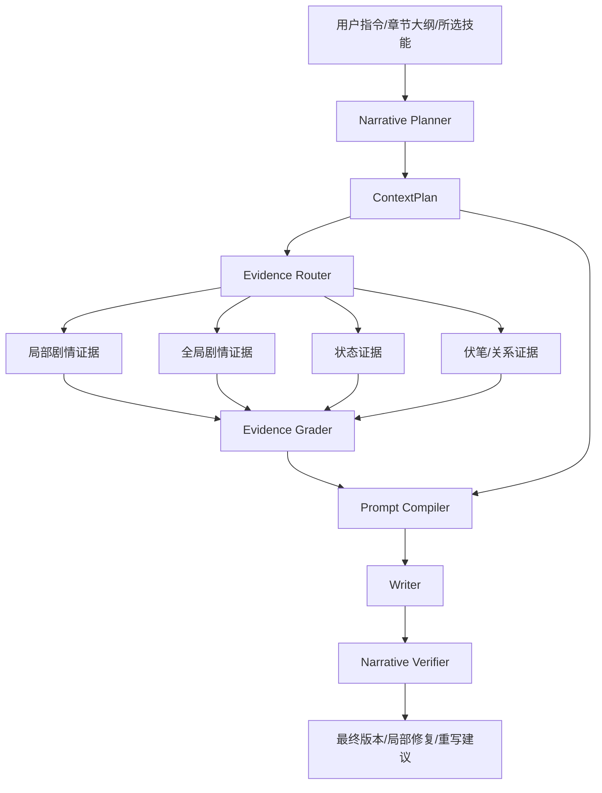

# 统一 Agentic RAG 技术方案草案

> 当前状态提示（2026-06-02）：本文是方案草案，不代表当前运行代码的完整事实。当前 RAG 访问层以 `ContextAccessService`、`ChapterContextService`、`EvidenceRouterService`、`HybridRetrievalService` 和 `VectorStoreService` 为准；当前索引中没有 `KnowledgeRetrievalService`，Agent 主流程也已收敛为顺序返回值驱动。

> 版本：v0.3
> 日期：2026-03-16
> 适用范围：`Arboris-Novel` 中文 AI 小说生成系统
> 状态：Phase 1/1.5/2 已完成 / Phase 3 方案已规划（时序记忆图 + 长期记忆蒸馏）

---

## 一、方案摘要

本方案旨在将系统中现有的 **Prompt 模板体系**、**Skill 技能体系**、**章节上下文检索体系**、**自创先进多 Agent 编排体系** 统一收敛到一个可控、可扩展、可观测的 `Agentic RAG` 决策层中。

本方案不追求把“Agentic”完全交给模型侧 `tools` 自主调用，而是采用更适合小说生成场景的路线：

- 由 **服务端编排器** 负责 Agentic 决策
- 由 **检索层** 负责证据召回与过滤
- 由 **Prompt 编译层** 负责上下文装配
- 由 **Skill 层** 负责策略声明与增强约束
- 由 **验证层** 负责生成后闭环校验

核心统一对象定义为：`ContextPlan`

---

## 零、当前实现状态

截至 `2026-03-16`，本方案第一阶段已基本完成，系统已从”`PipelineOrchestrator` 巨型流程 + 零散 mixin”显著演进为”service-first 编排”结构。

### 0.1 已落地的统一层

以下服务已经存在并接入主流程：

- `ContextPlannerService`
- `EvidenceRouterService`
- `HistoryContextService`
- `ContextAccessService`
- `EnhancedContextService`
- `PromptAssemblyService`
- `PromptCompilerService`
- `NarrativeVerifierService`
- `EnhancedReviewService`
- `GenerationTelemetryService`
- `GenerationResultService`
- `PipelineConfigService`
- `GenerationPolicyService`
- `GenerationSupportService`
- `GenerationContextResolutionService`
- `GenerationEvidenceStageService`
- `GenerationPromptContextService`
- `GenerationPromptStageService`
- `GenerationFinalizeService`
- `FastGenerationFlowService`
- `LiteraryGenerationFlowService`
- `StandardGenerationFlowService`
- `GenerationAnalysisTaskService`
- `GenerationWriteTaskService`
- `MissionBuilderService`
- `VersionGenerationService`
- `StandardPostProcessingService`
- `SceneGenerationService`
- `TextCompressionService`
- `VoiceSampleService`
- `SingleVersionGenerationService`
- `BatchGenerationService`

### 0.2 当前主线架构

当前单章生成主线已经基本收敛为：

1. `PipelineConfigService` 解析运行时配置
2. `HistoryContextService` / `ContextAccessService` 提供历史与记忆上下文
3. `ContextPlannerService` 产出 `ContextPlan`
4. `EvidenceRouterService` 执行任务式取证
5. `PromptAssemblyService` + `PromptCompilerService` 组装 Prompt
6. `VersionGenerationService` / `SceneGenerationService` 负责正文生成
7. `StandardPostProcessingService` 处理标准模式后处理链
8. `NarrativeVerifierService` 汇总生成后验证
9. `GenerationResultService` 统一返回值与调试元数据
10. `GenerationTelemetryService` 统一中间产物事件发射

### 0.3 已完成的结构性收口

- `PipelineContextMixin` 已退役，职责迁移到 `HistoryContextService` 与 `ContextAccessService`
- `PipelinePromptMixin` 已退役，职责迁移到 `PromptAssemblyService` 与 `PromptCompilerService`
- `PipelineOrchestrator` 已摆脱批量调度、配置解析、结果装配、Prompt 组装、验证汇总、scene 生成、压缩、voice sample、single version 生成等外围职责
- `simple RAG` 并行预取、伏笔 brief/结构化伏笔预取、项目长期记忆预取、用户风格偏好预取、风格指纹预取、增强上下文预热，已经分别迁移到 `EvidenceRouterService`、`ContextAccessService`、`UserStyleService`、`FingerprintService`、`EnhancedContextService`
- `Stage B` 后台分析、章节后处理、记忆更新、伏笔提取、六维异步审查都已迁移到后台任务服务
- Agent 路径中的 `ZhongshuAgent` 与主流水线已经共享 `ContextPlannerService`、`EvidenceRouterService`、`PipelineConfigService`

### 0.4 Phase 1 收尾完成情况（2026-03-16）

**已完成的收尾工作：**

1. **局部函数迁移到 GenerationTelemetryService**
   - 迁移了 `_mark_stage`、`_emit_stage`、`_emit_text_delta`、`_emit_completed` 等流式事件函数
   - `GenerationTelemetryService` 现在统一管理阶段耗时记录、事件发射和中间产物推送
   - `PipelineOrchestrator` 中的局部函数已大幅减少

2. **Token 预算控制系统**
   - 增强了 `ContextPlan.budgets` 字段，添加了细粒度的 Token 配额管理
   - 新增 `BudgetEnforcerService`，提供统一的预算执行和截断策略
   - `EvidenceRouterService` 已集成预算控制，防止 Prompt 过载和成本激增
   - 支持 Fast/Balanced 两种预算模式，分别对应 8k/16k 总上下文限制

3. **预算策略细节**
   - 每类检索任务都有明确的 Token 上限（RAG、历史、蓝图、Mission、记忆、技能、验证）
   - 支持基于优先级的预算分配
   - 超限时自动截断而非失败，并在句子边界智能截断
   - 达到 80% 使用率时自动警告

**仍保留在 PipelineOrchestrator 的部分：**

- 主流程 `generate_chapter()` 本身的阶段串联与时序控制（这是编排器的核心职责，应当保留）
- 少量 live path helper 与现有路由兼容代码

**Phase 1 状态：基本完成 ✅**

系统已经完成”架构主骨架切换”和”核心收尾工作”，Phase 1 的主要目标已达成。

## 二、背景与问题定义

### 2.1 当前系统优势

当前系统已经具备实现 Narrative Agentic RAG 的良好基础：

- 已有统一章节编排入口：`PipelineOrchestrator`
- 已有自创先进多 Agent 体系：`WritingAgentSystem`
- 已有 Prompt 模板与缓存加载：`PromptService`
- 已有历史章节、RAG、记忆层、伏笔、角色状态等上下文来源
- 已有 Skill 系统，并已开始接入 Agent 生成前链路

### 2.2 当前痛点

尽管模块丰富，但仍存在以下问题：

1. **Prompt、Skill、RAG 分属不同层次，缺少统一决策面**
2. **检索任务仍偏“固定式”，而非“任务式”**
3. **Skill 主要是写作增强器，尚未成为检索与验证策略的一部分**
4. **全局剧情上下文与局部章节证据尚未形成稳定双层 RAG**
5. **生成后验证存在，但尚未和生成前检索规划统一闭环**
6. **长篇中文小说的时序状态（人物/关系/伏笔）没有统一的时序记忆抽象**

### 2.3 为什么小说生成需要特殊的 Agentic RAG

小说生成与通用问答型 RAG 有本质区别：

- 目标不是“回答一个问题”，而是“续写一个持续演化的世界”
- 检索关注点不是单次答案准确率，而是 **长程连续性**、**角色稳定性**、**伏笔生命周期**、**节奏控制**、**风格一致性**
- 更适合 **确定性编排式 Agentic RAG**，而不是高自由度的工具调用代理

---

## 三、设计目标

### 3.1 总目标

构建一个统一的 Narrative Agentic RAG 层，使以下对象统一工作：

- Prompt
- Skill
- 检索任务
- 长短期记忆
- 生成后验证

### 3.2 子目标

1. 在生成前产出可观察、可调试的 `ContextPlan`
2. 将检索从“固定流程”升级为“任务路由”
3. 将 Skill 从“后处理器”升级为“策略声明器”
4. 支持局部剧情证据 + 全局故事结构证据的双层 RAG
5. 形成生成前规划 → 生成 → 生成后验证的闭环
6. 保持与当前系统兼容，支持渐进迁移

### 3.3 非目标

以下内容不作为第一阶段目标：

- 直接把所有生成逻辑改成模型侧 `tools` / function calling
- 一次性引入完整图数据库并替换现有存储
- 重写全部 Prompt 模板
- 移除当前 `PipelineOrchestrator`

---

## 四、外部实践调研结论

本方案综合参考了近期 GitHub 上较有代表性的 Agentic RAG 实践，包括但不限于：

- `langchain-ai/langgraph` 的 `Agentic RAG` 示例
- `NirDiamant/Controllable-RAG-Agent`
- `HKUDS/LightRAG`
- `getzep/graphiti`
- `qhjqhj00/MemoRAG`

### 4.1 可借鉴能力

| 项目 | 最值得借鉴的点 | 对小说生成的价值 |
|------|----------------|------------------|
| LangGraph Agentic RAG | 检索决策、query rewrite、relevance grading | 适合“本章需不需要检索、检索失败是否改写 query” |
| Controllable-RAG-Agent | 计划拆解、执行、验证、再规划 | 适合复杂章节任务拆解，如角色状态、伏笔、节奏、风格 |
| LightRAG | 局部实体关系 + 全局社区摘要 双层检索 | 非常适合“局部剧情 + 全局主线”双层上下文 |
| Graphiti | 时序知识图、增量更新、状态查询 | 适合人物/道具/关系/伏笔的时序记忆 |
| MemoRAG | 先建立全局记忆，再回忆 clues | 适合超长篇书级记忆，但成本较高 |

### 4.2 调研后的核心判断

最适合当前系统的路线是：

**Deterministic Narrative Agentic RAG**

即：

- Agentic 决策由服务端编排器控制
- 检索由任务路由驱动
- Prompt 由编译器模块装配
- Skill 声明检索/提示/验证策略
- 生成后进入受控验证闭环

---

## 五、统一架构设计

### 5.1 统一核心对象：ContextPlan

`ContextPlan` 是本方案的中心结构。它是章节生成前的统一上下文决策结果。

```python
ContextPlan = {
    "intent": {...},                 # 本章核心意图与爽点预期
    "chapter_phase": "...",          # 章节所处生命周期 (起步/过渡/高潮)
    "retrieval_tasks": [...],
    "skill_policies": [...],
    "prompt_modules": [...],
    "verification_tasks": [...],
    "budgets": {...},                # 严格的 Token 预算配额，防爆显存
    "is_fast_path": False,           # 是否为跳过冗杂评估的快行通道
}
```

### 5.2 总体流程图



### 5.3 核心模块

#### 5.3.1 Narrative Planner

负责从以下输入生成 `ContextPlan`：

- 当前章节大纲
- 用户写作指令
- 章节类型 / 情绪目标 / 爽点节奏（融合 `analytics_enhanced` 的多维情感数据）
- 章节生命周期阶段（开局/平稳发育/高潮爆发）
- 所选技能
- 近期章节状态

输出：

- 本章意图与核心爽点/期待感目标
- 应检索哪些来源及每类的动态权重（Lifecycle-Aware RAG）
- 启用哪些 Prompt 模块
- 启用哪些后验校验
- **快慢路决策 (Fast/Slow Path)**：若是日常过渡章，可决议跳过重度 Grader 和 Verifier 以降低延迟。

#### 5.3.2 Evidence Router

根据 `ContextPlan.retrieval_tasks` 执行多源检索，并动态适应章节生命周期调整检索权重。

建议分为四类检索及扩展：

1. `local_plot_rag`：上一章、最近几章、局部剧情 chunk。
2. `global_arc_rag`：故事骨架、卷级主线、长期剧情摘要。
3. `state_rag`：角色状态、地点状态、道具状态、关系状态，**必须包含角色的“当前心理与情感向量 (Psychological State)”**。
4. `symbolic_rag`：伏笔、阵营、规则、宪法与硬约束。为避免刻板，可引入**“熵增证据 (Entropy Item)”**，采用轮询或随机机制塞入 1-2 个处于沉睡期的线索或闲置人物，增加真实感。

#### 5.3.3 Evidence Grader

对召回证据做相关性判断：

- 文档是否与本章目标相关
- 是否需要 query rewrite
- 是否需要补检索一次

约束：

- 第一阶段最多重试一次
- 防止延迟无限膨胀
- **轻量化原则**：此类鉴别任务不应使用最昂贵的大模型，应指定使用极速小模型（如 Claude-3-Haiku / 8B级别本地模型）以降低整体生成延迟深渊。

#### 5.3.4 Prompt Compiler

根据 `prompt_modules` 进行模块化上下文装配，而不是固定全塞。

典型模块：

- `chapter_goal`
- `mission_brief`
- `previous_summary`
- `story_skeleton`
- `character_state`
- `foreshadowing_alerts`
- `rag_local`
- `rag_global`
- `skill_instructions`
- `hard_constraints`

#### 5.3.5 Narrative Verifier

统一生成后验证任务（底线防守与商业属性增强）：

- **底线防守（不出错）**：
  - 连续性检查
  - 人物/心理状态一致性检查
  - 剧情/伏笔处理检查
  - 剧透/越权信息检查
  - 风格漂移/技能目标验证
- **商业属性校验 (Commercial Hook Verify)**：
  - 断章点判定 (Cliffhanger Check)：评估全章末尾是否留有悬念或情绪高点。
  - 期待感核实 (Expectation Management)：判定 Planner 阶段定下的“核心爽点”是否真正落地。
- **降级机制（Commentary 批注系统）**：验证器不总是触发极其耗时的强制重写。可降级为“生成批注”，将逻辑漏洞或断章不足以高亮旁白形式展示给用户，引导人工介入，避免死循环消耗。

---

## 六、统一数据结构草图

### 6.1 ContextPlan 草图

```python
from dataclasses import dataclass, field
from typing import Any, Dict, List, Optional


@dataclass
class RetrievalTask:
    task_id: str
    source: str
    mode: str
    query_template: str
    priority: int = 1
    max_items: int = 5
    filters: Dict[str, Any] = field(default_factory=dict)


@dataclass
class SkillPolicy:
    skill_id: str
    phase: str  # pre_plan / retrieve / pre_prompt / verify / post_process
    params: Dict[str, Any] = field(default_factory=dict)
    retrieval_hints: List[str] = field(default_factory=list)
    prompt_hints: List[str] = field(default_factory=list)
    verify_hints: List[str] = field(default_factory=list)


@dataclass
class ContextPlan:
    intent: Dict[str, Any]
    chapter_phase: str  # e.g., "setup", "development", "climax", "resolution"
    retrieval_tasks: List[RetrievalTask]
    skill_policies: List[SkillPolicy]
    prompt_modules: List[str]
    verification_tasks: List[str]
    budgets: Dict[str, Any] = field(default_factory=dict)  # token上限控制
    is_fast_path: bool = False  # 是否为跳过评估的快车道
    metadata: Dict[str, Any] = field(default_factory=dict)
```

### 6.2 证据包草图

```python
@dataclass
class EvidenceItem:
    source: str
    title: str
    content: str
    score: float
    metadata: Dict[str, Any] = field(default_factory=dict)


@dataclass
class GenerationEvidencePack:
    local_plot: List[EvidenceItem] = field(default_factory=list)
    global_arc: List[EvidenceItem] = field(default_factory=list)
    state_items: List[EvidenceItem] = field(default_factory=list)
    symbolic_items: List[EvidenceItem] = field(default_factory=list)
    graded_summary: Dict[str, Any] = field(default_factory=dict)
```

### 6.3 技能接口扩展草图

建议把 Skill 从“只会 execute”扩展为“可声明策略”：

```python
class SkillBase:
    async def execute(...):
        ...

    async def build_policy(self, context) -> SkillPolicy:
        ...

    async def build_retrieval_hints(self, context) -> list[str]:
        return []

    async def build_prompt_hints(self, context) -> list[str]:
        return []

    async def build_verify_hints(self, context) -> list[str]:
        return []
```

---

## 七、Skill 与 Agentic RAG 的统一方式

### 7.1 Skill 的新定位

Skill 不再只是：

- 对当前文本做风格重写

而应该进一步具备：

- 检索提示声明
- Prompt 约束声明
- 生成后校验声明

### 7.2 典型 Skill 的统一策略

#### `dialogue_polish`

- 检索：历史对白、角色声纹样本
- Prompt：角色口头禅、语气稳定性约束
- Verify：对白风格是否漂移

#### `foreshadowing`

- 检索：未回收伏笔列表、相关章节片段
- Prompt：本章伏笔处理清单
- Verify：是否完成埋设/强化/回收

#### `rhythm_control`

- 检索：近 5 章节奏分布、爽点密度
- Prompt：节奏控制与场景配额
- Verify：本章是否达到节奏目标

#### `consistency_check`

- 检索：人物状态、时间线、规则边界
- Prompt：硬性设定约束
- Verify：冲突是否消除

---

## 八、与现有系统的映射关系

### 8.1 可直接复用的模块

| 现有模块 | 可复用角色 |
|----------|------------|
| `PipelineOrchestrator` | 总编排器 / 当前仍承担主流程编排 |
| `PipelineConfigService` | 运行时预设与开关解析 |
| `GenerationPolicyService` | 温度、阶段 flags、文学模式策略 |
| `HistoryContextService` / `ContextAccessService` | 历史上下文与上下文访问基础 |
| `EvidenceRouterService` | 任务式取证主执行器 |
| `KnowledgeRetrievalService` | 两阶段检索与过滤基础 |
| `PromptService` | Prompt 模板仓库 |
| `PromptAssemblyService` / `PromptCompilerService` | Prompt 组装与编译基础 |
| `SkillService` | Skill 注册与执行基础 |
| `HubuAgent` | Skill Policy Compiler |
| `MemoryLayerService` | 时序记忆服务基础 |
| `ForeshadowingService` | 符号级证据源 |
| `NarrativeVerifierService` | 验证汇总层 |
| `GenerationTelemetryService` | 中间产物发射层 |
| `GenerationResultService` | 返回值与调试元数据装配 |
| `VersionGenerationService` / `StandardPostProcessingService` | 标准模式生成阶段与后处理阶段 |
| `SceneGenerationService` / `TextCompressionService` | 文学模式场景生成与压缩层 |
| `MissionBuilderService` / `VoiceSampleService` | fast/basic mission 与声纹样本支持 |
| `BatchGenerationService` | 批量生成调度 |
| `GenerationSupportService` | 蓝图、参考小说、fast RAG query、爽点节奏支持 |

### 8.2 建议新增模块

建议新增以下服务：

- `backend/app/services/context_planner_service.py`
- `backend/app/services/evidence_router_service.py`
- `backend/app/services/evidence_grader_service.py`
- `backend/app/services/prompt_compiler_service.py`
- `backend/app/services/narrative_verifier_service.py`
- `backend/app/services/temporal_memory_service.py`

当前已经实际落地的新增服务：

- `backend/app/services/history_context_service.py`
- `backend/app/services/context_access_service.py`
- `backend/app/services/prompt_assembly_service.py`
- `backend/app/services/generation_telemetry_service.py`
- `backend/app/services/generation_result_service.py`
- `backend/app/services/pipeline_config_service.py`
- `backend/app/services/generation_policy_service.py`
- `backend/app/services/generation_support_service.py`
- `backend/app/services/mission_builder_service.py`
- `backend/app/services/version_generation_service.py`
- `backend/app/services/standard_post_processing_service.py`
- `backend/app/services/scene_generation_service.py`
- `backend/app/services/text_compression_service.py`
- `backend/app/services/voice_sample_service.py`
- `backend/app/services/single_version_generation_service.py`
- `backend/app/services/batch_generation_service.py`

### 8.3 与先进多 Agent 架构的职责映射

| Agent | 新职责建议 |
|-------|------------|
| 需求解析 | 需求解析、任务类型判断 |
| 规划 | 生成 `ContextPlan` |
| 技能智能体 | 编译 SkillPolicy |
| 协调 | 调度 retrieval / verify / writer |
| 生成智能体 | 专注正文生成 |
| 一致性智能体 | 连续性 / 状态类校验 |
| 审核 | 质量审核、最终把关 |

---

## 九、实施路线图

## 9.1 Phase 1：最小可落地统一层（推荐 2~3 周）

目标：在不破坏现有生成链路的前提下，引入统一决策对象。

当前状态：`基本完成 ✅`（2026-03-16）

### 范围

- 新增 `ContextPlan`（含生命周期 phase 与 token budgets 限制）
- 新增 Narrative Planner，融入 `analytics_enhanced` 的多维情感数据
- 对现有检索增加 `retrieval_tasks` 路由，并实验性引入少量“熵增证据”
- **轻量化接入** relevance grading（使用低成本极速模型）
- 引入 Commentary 批注系统作为初期 Verifier 的替代方案，避免无限重写
- Skill 支持 `retrieval_hints` / `prompt_hints` / `verify_hints`
- Prompt 编译按模块开关装配

### 产物

- `ContextPlan` 可序列化输出且**支持白盒化交互**（允许用户在前端修改或废弃偏离意图的检索计划）
- 中间产物中可查看计划与任务清单
- Agent 模式与流水线模式都能复用该计划层

当前已落地产物：

- `context_plan`
- `retrieval_evidence_summary`
- `prompt_compile_summary`
- `verification_report`
- `skill_policies`
- service-first 的 generation pipeline

### 验收标准

- 每次生成都能透明产出 `ContextPlan` 并供用户调整
- 检索日志按任务维度可观测
- Prompt 中可区分局部 / 全局 / 状态 / 技能模块

## 9.2 Phase 2：双层叙事 RAG（推荐 3~5 周）

目标：实现局部剧情 + 全局叙事双层检索。

当前状态：`已完成`

### 范围

- 建立卷级 / 书级剧情摘要索引
- 建立全局社区摘要或主线摘要层
- `rag_context` 升级为多层证据包

### 参考思路

- 借鉴 LightRAG 的“局部证据 + 全局结构摘要”模式

### 验收标准

- 长篇章节（30+）的一致性显著提升
- 伏笔与主线回收命中率提升

当前已落地部分：

- `local_plot_rag / global_arc_rag / state_rag / symbolic_rag` 已进入 `EvidenceRouterService`
- `two_stage RAG` 已收口到统一路由层
- 证据包与证据摘要已进入中间产物链路
- ✅ 卷级摘要索引（`VolumeSummaryService`）：固定分卷 + 增量 hash 更新 + 向量入库
  - `VolumeSummary` ORM 模型 (`models/project_memory.py`)
  - 章节 finalize 后自动增量更新卷摘要 (`ChapterPostProcessor._update_volume_summary`)
  - 手动全量重建 API (`POST /novels/{project_id}/volumes/rebuild-summaries`)
  - 查询 API (`GET /novels/{project_id}/volumes/summaries`)
  - `EvidenceRouterService.route_global_arc` 自动注入相关卷摘要
  - 测试覆盖：7 例 (`test_volume_summary_service.py`)
- ✅ 全局书级摘要层（`BookSummaryService`）：聚合卷级摘要为全书摘要
  - 复用 `ProjectMemory.global_summary` 字段，`extra` JSON 存 `book_summary_hash` 做增量检测
  - 卷摘要更新后自动触发书级摘要更新 (`ChapterPostProcessor._update_book_summary`)
  - 手动重建 API (`POST /novels/{project_id}/book-summary/rebuild`)
  - 查询 API (`GET /novels/{project_id}/book-summary`)
  - `EvidenceRouterService.route_global_arc` 自动注入书级摘要（score=0.85）
  - 向量入库 ID: `{project_id}:book:summary`
  - 测试覆盖：6 例 (`test_book_summary_service.py`)

## 9.3 Phase 3：时序记忆图 + 长期记忆蒸馏（推荐 4~8 周）

目标：① 统一”截至第 N 章”的多维状态视图查询；② 解决 mem0 长期记忆无限增长问题，引入记忆蒸馏与生命周期管理。

当前状态：`未完成`

### 问题分析

**时序状态碎片化**：CharacterState、TimelineEvent、CausalChain、Foreshadowing、PowerSystem 各自独立查询，没有统一的”截至第 N 章世界快照”抽象。`EvidenceRouterService.route_state()` 只取了 CharacterState + power_level，大量已有时序数据（因果链、伏笔紧迫度、时间线）未被充分利用。

**mem0 无限增长**：每章 finalize 后 `_extract_mem0_facts()` 提取 N 条原子事实直接 `memory.add()` 存入 Qdrant，只增不减。30+ 章后 mem0 中会累积数百条事实，其中大量是冗余（”角色A在第5章位于京城”、”角色A在第8章位于京城”）或已被后续事件覆盖的过期信息。search 返回结果充斥低价值重复，浪费 token 预算且稀释关键信息的浓度。

### 已有基础

| 组件 | 状态 | 说明 |
|------|------|------|
| `CharacterState` | ✅ 完整 | 每章一条快照，支持按章节查询最新状态 |
| `TimelineEvent` | ✅ 完整 | 支持 major/minor/background 分类，有 caused_by 自指 |
| `CausalChain` | ✅ 完整 | pending/resolved/abandoned 生命周期 |
| `StoryTimeTracker` | ✅ 完整 | chapter_time_map 记录每章时间跨度 |
| `Foreshadowing` | ✅ 完整 | urgency 紧迫度 + status 生命周期 + target_reveal_chapter |
| `PowerSystem/Level` | ✅ 完整 | 力量体系层级定义 |
| `ChapterSnapshot` | ✅ 完整 | 每章定稿时的全局摘要+角色状态+剧情线快照 |
| `ProjectMemory` | ✅ 完整 | global_summary + plot_arcs + story_timeline_summary |
| `MemoryLayerService` | ✅ 完整 | build_chapter_state_context() 纯 DB <100ms |
| `EvidenceRouterService.route_state()` | ✅ 已集成 | 但只取 CharacterState + power_level |
| mem0 事实提取+存储 | ✅ 已实现 | `_extract_mem0_facts()` → `memory.add()` |
| mem0 蒸馏/压缩/清理 | ❌ 缺失 | 只增不减，无生命周期管理 |
| 统一时序状态视图 | ❌ 缺失 | 各表独立查询，无统一抽象 |

### 设计方案

#### 3.1 统一时序状态视图：`TemporalStateService`

**核心思路**：不引入图数据库，在现有 MySQL + Qdrant 基础上构建统一查询层。

```python
@dataclass
class WorldStateSnapshot:
    “””截至第 N 章的世界状态快照”””
    chapter_number: int

    # 角色维度
    character_states: List[CharacterState]       # 每个角色的最新状态
    active_relationships: List[Dict[str, Any]]   # 从 blueprint_relationships 取活跃关系

    # 事件维度
    recent_major_events: List[TimelineEvent]     # 近 N 章重大事件
    pending_causal_chains: List[CausalChain]     # 待解决因果链

    # 伏笔维度
    urgent_foreshadowings: List[Dict[str, Any]]  # 紧迫伏笔（urgency≥8 或即将到期）
    overdue_foreshadowings: List[Dict[str, Any]] # 逾期伏笔（埋下 20+ 章未处理）

    # 时间维度
    story_time: Optional[str]                    # 当前故事时间
    story_date: Optional[str]                    # 当前故事日期

    # 力量维度
    power_landscape: List[Dict[str, str]]        # [{character, level, system}]
```

**新增服务**：`backend/app/services/temporal_state_service.py`

```python
class TemporalStateService:
    “””统一时序状态查询服务 — 纯 DB 查询，零 LLM 调用”””

    async def get_world_snapshot(
        self, project_id: str, chapter_number: int,
        involved_characters: Optional[List[str]] = None,
    ) -> WorldStateSnapshot:
        “””获取截至第 N 章的世界状态快照（目标延迟 <200ms）”””
        # 并行查询 5 个数据源
        ...

    async def format_for_evidence(
        self, snapshot: WorldStateSnapshot, budget_tokens: int = 2000,
    ) -> List[EvidenceItem]:
        “””将快照格式化为 EvidenceItem 列表，供 route_state 使用”””
        # 按优先级装配：紧迫伏笔 > 角色状态 > 因果链 > 事件 > 力量
        # 在 budget_tokens 内截断
        ...

    async def diff_between_chapters(
        self, project_id: str, from_chapter: int, to_chapter: int,
    ) -> Dict[str, Any]:
        “””两章之间的状态变化差分（用于 Verifier 一致性校验）”””
        ...
```

**集成点**：
- `EvidenceRouterService.route_state()` 改为调用 `TemporalStateService.get_world_snapshot()` + `format_for_evidence()`，替代当前散落的单表查询
- `NarrativeVerifierService` 可使用 `diff_between_chapters()` 做生成后一致性校验

#### 3.2 mem0 记忆蒸馏：`MemoryDistillationService`

**核心思路**：每 N 章（默认 10 章，与卷级摘要对齐）对 mem0 中的原子事实执行一次”蒸馏”——用 LLM 将冗余/过期事实归并为精炼摘要，删除被覆盖的旧事实。

**蒸馏流程**：

```
触发时机：章节 finalize 且 chapter_number % distill_interval == 0
                    ↓
    ① memory.get_all(user_id=project_id)  — 取全量事实
                    ↓
    ② 按语义聚类分组（角色状态类 / 事件类 / 世界设定类）
                    ↓
    ③ LLM 蒸馏：每组 N 条原子事实 → 1-3 条精炼陈述
       - 合并冗余（同一角色多次位置更新 → 保留最新）
       - 标记过期（已被后续事件覆盖的事实）
       - 提升抽象（细节事件 → 阶段性总结）
                    ↓
    ④ memory.delete() 旧事实 + memory.add() 蒸馏后事实
                    ↓
    ⑤ 记录蒸馏报告到 GenerationTelemetryService
```

**新增服务**：`backend/app/services/memory_distillation_service.py`

```python
class MemoryDistillationService:
    “””mem0 长期记忆蒸馏服务”””

    # 配置
    DISTILL_INTERVAL: int = 10          # 每 10 章蒸馏一次
    MAX_FACTS_BEFORE_DISTILL: int = 100 # 超过 100 条强制蒸馏
    TARGET_FACTS_AFTER_DISTILL: int = 30 # 蒸馏后目标条数

    async def should_distill(self, project_id: str, chapter_number: int) -> bool:
        “””判断是否需要蒸馏”””
        # 条件 1: chapter_number % DISTILL_INTERVAL == 0
        # 条件 2: 当前 mem0 事实总数 > MAX_FACTS_BEFORE_DISTILL
        ...

    async def distill(
        self, project_id: str, chapter_number: int, user_id: int,
    ) -> Dict[str, Any]:
        “””执行蒸馏”””
        # 1. 从 mem0 获取全量事实
        # 2. 与结构化状态交叉验证（CharacterState 是 ground truth）
        # 3. LLM 归并蒸馏
        # 4. 替换 mem0 中的旧事实
        # 返回 {before_count, after_count, removed, merged, report}
        ...

    async def _classify_facts(self, facts: List[Dict]) -> Dict[str, List[Dict]]:
        “””按语义对事实分组（规则优先，LLM 兜底）”””
        # 关键词匹配：角色名→character, 地点→location, 获得/失去→inventory, ...
        ...

    async def _merge_group(
        self, group_name: str, facts: List[Dict], user_id: int,
    ) -> List[str]:
        “””将一组同类事实归并为精炼陈述”””
        ...
```

**蒸馏策略细节**：

| 事实类型 | 蒸馏规则 | 示例 |
|----------|----------|------|
| 角色位置 | 只保留最新位置 | “A在第3章到了京城” + “A在第7章到了边关” → “A当前在边关（第7章起）” |
| 角色情绪 | 保留最新 + 重大转折 | 日常情绪变化删除，仅保留”A在第5章因B背叛而愤怒” |
| 物品获取 | 增量合并 | “A获得剑” + “A获得盾” → “A持有：剑、盾” |
| 关系变化 | 保留最新状态 | “A与B关系紧张” + “A与B和好” → “A与B当前关系友好（第8章和好）” |
| 重大事件 | 保留，不蒸馏 | importance ≥ 8 的事件原样保留 |
| 世界设定 | 去重合并 | 重复的设定类事实合并为一条 |

**触发集成**：挂载到 `ChapterPostProcessor` 的 finalize 链路中，位于卷摘要更新之后。

```
ChapterPostProcessor.finalize_chapter()
  → _update_volume_summary()
  → _update_book_summary()
  → _distill_memory_if_needed()    ← 新增
```

#### 3.3 route_state 增强

当前 `EvidenceRouterService.route_state()` 只取 CharacterState + power_level 两个维度。升级后：

**Before**:
```python
# route_state 当前实现
memory_service = MemoryLayerService(session, llm_service, prompt_service)
state_text = await memory_service.build_chapter_state_context(...)
# 只有：角色状态 + 近3章事件 + 因果链
```

**After**:
```python
# route_state 升级后
temporal_service = TemporalStateService(session)
snapshot = await temporal_service.get_world_snapshot(project_id, chapter_number, involved_characters)
state_evidence = await temporal_service.format_for_evidence(snapshot, budget_tokens=budgets[“state_items”])
evidence_pack.state_items.extend(state_evidence)
# 包含：角色状态 + 紧迫伏笔 + 因果链 + 力量格局 + 故事时间 + 关系网
```

### 验收标准

1. `TemporalStateService.get_world_snapshot()` 纯 DB 查询，延迟 <200ms
2. 30+ 章项目蒸馏后 mem0 事实数量从 200+ 降至 30-50 条
3. `route_state` 返回的 state_items 包含伏笔紧迫度和因果链信息
4. 蒸馏过程不丢失重大事件（importance ≥ 8）
5. 蒸馏报告可通过中间产物面板查看

### 注意事项

- 不引入图数据库，在现有 MySQL + Qdrant 上实现
- 蒸馏使用轻量级模型（与 EvidenceGrader 共用 `llm_grader.*` 配置通道）
- `build_chapter_state_context()` 保留作为轻量备选（fast_path 模式下使用）
- mem0 蒸馏是异步后台任务，不阻塞章节生成主流程

### 分步实施建议

| 步骤 | 内容 | 依赖 | 预估工作量 |
|------|------|------|-----------|
| 3.1a | `TemporalStateService` — 统一查询层 + `WorldStateSnapshot` | 无 | 1 周 |
| 3.1b | `route_state` 切换到 `TemporalStateService` | 3.1a | 2-3 天 |
| 3.2a | `MemoryDistillationService` — 蒸馏核心逻辑 | 无 | 1 周 |
| 3.2b | 挂载到 `ChapterPostProcessor` finalize 链路 | 3.2a | 1-2 天 |
| 3.2c | mem0 蒸馏配置项（interval、阈值）加入 `Settings` | 3.2a | 半天 |
| 3.3 | `diff_between_chapters` + Verifier 一致性校验集成 | 3.1a | 3-5 天 |
| 3.4 | 测试 + 文档 + 中间产物面板展示蒸馏报告 | 3.1-3.3 | 3-5 天 |

---

## 十、技术接口草图

### 10.1 Planner 接口

```python
class ContextPlannerService:
    async def build_plan(
        self,
        *,
        project_id: str,
        chapter_number: int,
        writing_notes: str,
        flow_config: dict,
        selected_skills: list[dict],
        user_id: int,
    ) -> ContextPlan:
        ...
```

### 10.2 检索路由接口

```python
class EvidenceRouterService:
    async def execute(
        self,
        *,
        plan: ContextPlan,
        user_id: int,
    ) -> GenerationEvidencePack:
        ...
```

### 10.3 Prompt 编译接口

```python
class PromptCompilerService:
    async def compile(
        self,
        *,
        plan: ContextPlan,
        evidence_pack: GenerationEvidencePack,
    ) -> list[tuple[str, str]]:
        ...
```

### 10.4 验证器接口

```python
class NarrativeVerifierService:
    async def verify(
        self,
        *,
        plan: ContextPlan,
        chapter_text: str,
        evidence_pack: GenerationEvidencePack,
    ) -> dict:
        ...
```

### 10.5 前端中间产物建议扩展

建议在现有中间产物面板基础上新增：

- `context_plan`
- `retrieval_tasks`
- `retrieval_evidence_summary`
- `verification_report`

---

## 十一、评估指标

建议引入以下指标：

- `retrieval_hit_rate`
- `retrieval_retry_rate`
- `continuity_issue_rate`
- `foreshadowing_resolution_rate`
- `style_drift_rate`
- `avg_prompt_tokens`
- `avg_generation_latency_ms`
- `post_generation_rewrite_rate`
- `chapter_regeneration_rate`
- `user_selected_version_match_rate`

---

## 十二、风险与缓解

### 12.1 风险

1. 检索规划过重、串行链路长导致的”生成延迟深渊”
2. Prompt 过载导致生成质量下降、Token 成本激增
3. Skill 之间约束冲突
4. 中文实体状态抽取噪声高
5. 全局摘要与局部片段之间产生信息不一致
6. Grader 评估过严抹杀 AI 生成的神来之笔，丧失生活气息
7. mem0 长期记忆无限增长，search 结果充斥低价值冗余事实，稀释关键信息浓度
8. 蒸馏过程误删重要事实，导致后续章节丢失关键上下文

### 12.2 缓解措施

- 在 ContextPlan 严格设定每类检索任务的预算配额 (Budgets)
- 增加快慢路 (Fast/Slow Path) 设计，日常章可跳过繁琐重度评估
- evidence grading 指派轻量级小模型，且最多只允许一次重试
- 在提示词装配中随机轮询”熵增证据”，避免生成内容枯燥套路化
- Skill 引入优先级与冲突规则
- 先做结构化状态（重点加强”人物心理与情感坐标”），再做复杂图谱
- 全局摘要采用渐进更新，而非每次全量重算
- mem0 蒸馏以结构化数据（CharacterState）为 ground truth 交叉验证，importance ≥ 8 的事实免蒸馏
- 蒸馏前自动备份原始事实到 WritingArchive，支持回滚

---

## 十三、最终建议

建议采用以下实施策略：

### 13.1 方案名称

**Deterministic Narrative Agentic RAG**

### 13.2 核心原则

- Agentic 在编排层，不在模型自由工具调用层
- Skill 是策略声明器，不只是文本后处理器
- 检索按任务路由，不按固定模板统一检索
- Prompt 由模块编译，而非固定堆叠
- 生成后必须有统一验证闭环

### 13.3 一句话总结

> 用 `ContextPlan` 统一 Prompt、Skill、检索、验证，使自创先进多 Agent 架构从“多 Agent 写作流程”升级为“多 Agent 叙事决策流程”。

---

## 十四、建议的下一步实施任务

基于当前代码状态（2026-03-16），建议按以下顺序继续推进：

### Phase 1 收尾（已完成 ✅）
1. ~~继续收缩 `PipelineOrchestrator` 中仍保留的 live helper~~ ✅
2. ~~整理 `two_stage RAG` 与多源取证的统一执行预算~~ ✅

### Phase 1.5 完善（已完成 ✅）
1. ~~**引入 EvidenceGraderService**：评估并接入轻量级相关性评分（使用 Claude-3-Haiku 或 8B 级别本地模型）~~ ✅
   - `EvidenceGraderService` 已实现，集成到 `GenerationEvidenceStageService`
   - LLMService 新增 `_resolve_grader_llm_config()` + `get_grader_llm_response()`（`llm_grader.*` 配置通道）
   - 未配置时静默跳过，fast_path 模式下跳过，单次批量评分，最多重试一次
   - 评分结果写回 `EvidenceItem.metadata["grader_score"]`，低分项标记 `graded_out`
   - `GenerationTelemetryService` 新增 `emit_evidence_grade()` 事件
2. ~~**前端白盒化增强**：在 WritingDesk.vue 中增强中间产物面板，支持 context_plan 展示与编辑~~ ✅
   - MiddleProductViewer 新增「评分」Tab，展示每个证据项的 grader 评分和过滤状态
   - WDSidebar 新增「计划」按钮，调用 `POST /preview-plan` API 预览 ContextPlan
   - WritingDesk.vue 新增 `evidence_grade` 事件处理和预览逻辑
   - NovelAPI 新增 `previewContextPlan()` 方法
3. ~~**补齐回归测试**：为新的 service-first 架构补充回归测试矩阵~~ ✅
   - 新增 `test_evidence_grader_service.py`（9 个测试用例）
   - 扩展 `test_service_first_regression_matrix.py`（+3 个集成测试）
   - 修复 `_DummySession` 缺少 `execute` 方法导致的回归失败
   - 全部 17 个相关测试通过

### Phase 2 推进（建议 3~5 周）
1. ~~建立卷级/书级剧情摘要索引~~ ✅
   - 卷级：`VolumeSummaryService`（固定分卷 + 增量 hash + 向量入库）
   - 书级：`BookSummaryService`（聚合卷摘要 + 增量 hash + 向量入库）
   - 触发链：章节 finalize → 卷摘要更新 → 书级摘要更新
2. ~~实现全局社区摘要层（参考 LightRAG）~~ ✅（通过书级摘要实现）
3. ~~完善双层 RAG 的证据融合策略~~ ✅
   - `ContextPlannerService._build_evidence_budgets()`: 四类证据的 token/数量预算（fast vs balanced）
   - `EvidenceRouterService._enforce_evidence_budgets()`: score 降序排序 → 数量限制 → token 截断 → 报告
   - 预算报告写入 `task_reports["evidence_budget"]`
   - 测试覆盖：6 例 (`test_evidence_budget_enforcement.py`)

### Phase 3 推进：时序记忆图 + 长期记忆蒸馏（建议 4~8 周）

**3.1 统一时序状态视图**
1. 新增 `TemporalStateService` + `WorldStateSnapshot` 数据结构
   - 并行查询 CharacterState / TimelineEvent / CausalChain / Foreshadowing / StoryTimeTracker / PowerSystem
   - 纯 DB 查询，目标延迟 <200ms
   - `format_for_evidence()` 按优先级将快照格式化为 EvidenceItem 列表
2. `EvidenceRouterService.route_state()` 切换到 `TemporalStateService`
   - 替代当前散落的单表查询
   - state_items 增加伏笔紧迫度、因果链、力量格局、故事时间等维度
3. `diff_between_chapters()` 供 NarrativeVerifierService 做生成后一致性校验

**3.2 mem0 长期记忆蒸馏**
1. 新增 `MemoryDistillationService`
   - 触发条件：chapter_number % 10 == 0 或 mem0 事实总数 > 100
   - 流程：取全量事实 → 规则分组 → LLM 归并蒸馏 → 替换旧事实
   - 蒸馏目标：200+ 条 → 30-50 条精炼陈述
   - 使用轻量级模型（共用 `llm_grader.*` 配置通道）
2. 挂载到 `ChapterPostProcessor` finalize 链路
   - 位于卷摘要更新之后，异步执行不阻塞主流程
3. 蒸馏配置项加入 `Settings`（interval、阈值、目标条数）
4. 蒸馏报告通过 `GenerationTelemetryService` 写入中间产物

