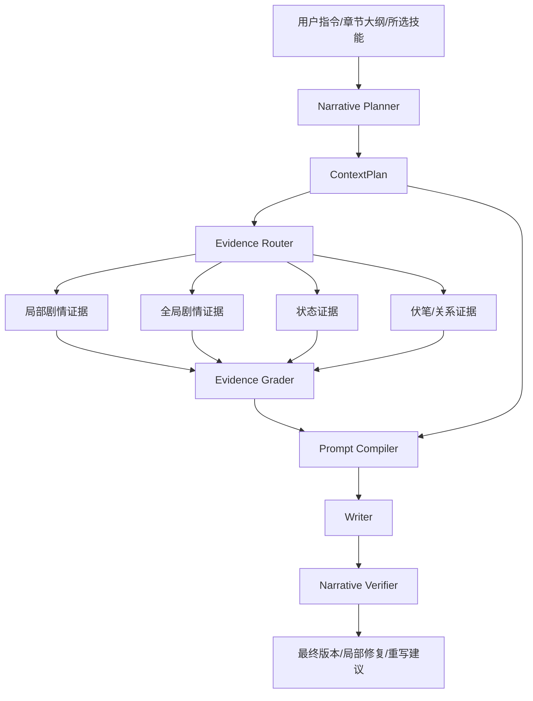

# 统一 Agentic RAG 技术方案草案

> 版本：v0.1  
> 日期：2026-03-09  
> 适用范围：`Arboris-Novel` 中文 AI 小说生成系统  
> 状态：方案草案 / 可进入第一阶段实现

---

## 一、方案摘要

本方案旨在将系统中现有的 **Prompt 模板体系**、**Skill 技能体系**、**章节上下文检索体系**、**三省六部 Agent 编排体系** 统一收敛到一个可控、可扩展、可观测的 `Agentic RAG` 决策层中。

本方案不追求把“Agentic”完全交给模型侧 `tools` 自主调用，而是采用更适合小说生成场景的路线：

- 由 **服务端编排器** 负责 Agentic 决策
- 由 **检索层** 负责证据召回与过滤
- 由 **Prompt 编译层** 负责上下文装配
- 由 **Skill 层** 负责策略声明与增强约束
- 由 **验证层** 负责生成后闭环校验

核心统一对象定义为：`ContextPlan`

---

## 二、背景与问题定义

### 2.1 当前系统优势

当前系统已经具备实现 Narrative Agentic RAG 的良好基础：

- 已有统一章节编排入口：`PipelineOrchestrator`
- 已有三省六部多 Agent 体系：`WritingAgentSystem`
- 已有 Prompt 模板与缓存加载：`PromptService`
- 已有历史章节、RAG、记忆层、伏笔、角色状态等上下文来源
- 已有 Skill 系统，并已开始接入 Agent 生成前链路

### 2.2 当前痛点

尽管模块丰富，但仍存在以下问题：

1. **Prompt、Skill、RAG 分属不同层次，缺少统一决策面**
2. **检索任务仍偏“固定式”，而非“任务式”**
3. **Skill 主要是写作增强器，尚未成为检索与验证策略的一部分**
4. **全局剧情上下文与局部章节证据尚未形成稳定双层 RAG**
5. **生成后验证存在，但尚未和生成前检索规划统一闭环**
6. **长篇中文小说的时序状态（人物/关系/伏笔）没有统一的时序记忆抽象**

### 2.3 为什么小说生成需要特殊的 Agentic RAG

小说生成与通用问答型 RAG 有本质区别：

- 目标不是“回答一个问题”，而是“续写一个持续演化的世界”
- 检索关注点不是单次答案准确率，而是 **长程连续性**、**角色稳定性**、**伏笔生命周期**、**节奏控制**、**风格一致性**
- 更适合 **确定性编排式 Agentic RAG**，而不是高自由度的工具调用代理

---

## 三、设计目标

### 3.1 总目标

构建一个统一的 Narrative Agentic RAG 层，使以下对象统一工作：

- Prompt
- Skill
- 检索任务
- 长短期记忆
- 生成后验证

### 3.2 子目标

1. 在生成前产出可观察、可调试的 `ContextPlan`
2. 将检索从“固定流程”升级为“任务路由”
3. 将 Skill 从“后处理器”升级为“策略声明器”
4. 支持局部剧情证据 + 全局故事结构证据的双层 RAG
5. 形成生成前规划 → 生成 → 生成后验证的闭环
6. 保持与当前系统兼容，支持渐进迁移

### 3.3 非目标

以下内容不作为第一阶段目标：

- 直接把所有生成逻辑改成模型侧 `tools` / function calling
- 一次性引入完整图数据库并替换现有存储
- 重写全部 Prompt 模板
- 移除当前 `PipelineOrchestrator`

---

## 四、外部实践调研结论

本方案综合参考了近期 GitHub 上较有代表性的 Agentic RAG 实践，包括但不限于：

- `langchain-ai/langgraph` 的 `Agentic RAG` 示例
- `NirDiamant/Controllable-RAG-Agent`
- `HKUDS/LightRAG`
- `getzep/graphiti`
- `qhjqhj00/MemoRAG`

### 4.1 可借鉴能力

| 项目 | 最值得借鉴的点 | 对小说生成的价值 |
|------|----------------|------------------|
| LangGraph Agentic RAG | 检索决策、query rewrite、relevance grading | 适合“本章需不需要检索、检索失败是否改写 query” |
| Controllable-RAG-Agent | 计划拆解、执行、验证、再规划 | 适合复杂章节任务拆解，如角色状态、伏笔、节奏、风格 |
| LightRAG | 局部实体关系 + 全局社区摘要 双层检索 | 非常适合“局部剧情 + 全局主线”双层上下文 |
| Graphiti | 时序知识图、增量更新、状态查询 | 适合人物/道具/关系/伏笔的时序记忆 |
| MemoRAG | 先建立全局记忆，再回忆 clues | 适合超长篇书级记忆，但成本较高 |

### 4.2 调研后的核心判断

最适合当前系统的路线是：

**Deterministic Narrative Agentic RAG**

即：

- Agentic 决策由服务端编排器控制
- 检索由任务路由驱动
- Prompt 由编译器模块装配
- Skill 声明检索/提示/验证策略
- 生成后进入受控验证闭环

---

## 五、统一架构设计

### 5.1 统一核心对象：ContextPlan

`ContextPlan` 是本方案的中心结构。它是章节生成前的统一上下文决策结果。

```python
ContextPlan = {
    "intent": {...},                 # 本章核心意图与爽点预期
    "chapter_phase": "...",          # 章节所处生命周期 (起步/过渡/高潮)
    "retrieval_tasks": [...],
    "skill_policies": [...],
    "prompt_modules": [...],
    "verification_tasks": [...],
    "budgets": {...},                # 严格的 Token 预算配额，防爆显存
    "is_fast_path": False,           # 是否为跳过冗杂评估的快行通道
}
```

### 5.2 总体流程图



### 5.3 核心模块

#### 5.3.1 Narrative Planner

负责从以下输入生成 `ContextPlan`：

- 当前章节大纲
- 用户写作指令
- 章节类型 / 情绪目标 / 爽点节奏（融合 `analytics_enhanced` 的多维情感数据）
- 章节生命周期阶段（开局/平稳发育/高潮爆发）
- 所选技能
- 近期章节状态

输出：

- 本章意图与核心爽点/期待感目标
- 应检索哪些来源及每类的动态权重（Lifecycle-Aware RAG）
- 启用哪些 Prompt 模块
- 启用哪些后验校验
- **快慢路决策 (Fast/Slow Path)**：若是日常过渡章，可决议跳过重度 Grader 和 Verifier 以降低延迟。

#### 5.3.2 Evidence Router

根据 `ContextPlan.retrieval_tasks` 执行多源检索，并动态适应章节生命周期调整检索权重。

建议分为四类检索及扩展：

1. `local_plot_rag`：上一章、最近几章、局部剧情 chunk。
2. `global_arc_rag`：故事骨架、卷级主线、长期剧情摘要。
3. `state_rag`：角色状态、地点状态、道具状态、关系状态，**必须包含角色的“当前心理与情感向量 (Psychological State)”**。
4. `symbolic_rag`：伏笔、阵营、规则、宪法与硬约束。为避免刻板，可引入**“熵增证据 (Entropy Item)”**，采用轮询或随机机制塞入 1-2 个处于沉睡期的线索或闲置人物，增加真实感。

#### 5.3.3 Evidence Grader

对召回证据做相关性判断：

- 文档是否与本章目标相关
- 是否需要 query rewrite
- 是否需要补检索一次

约束：

- 第一阶段最多重试一次
- 防止延迟无限膨胀
- **轻量化原则**：此类鉴别任务不应使用最昂贵的大模型，应指定使用极速小模型（如 Claude-3-Haiku / 8B级别本地模型）以降低整体生成延迟深渊。

#### 5.3.4 Prompt Compiler

根据 `prompt_modules` 进行模块化上下文装配，而不是固定全塞。

典型模块：

- `chapter_goal`
- `mission_brief`
- `previous_summary`
- `story_skeleton`
- `character_state`
- `foreshadowing_alerts`
- `rag_local`
- `rag_global`
- `skill_instructions`
- `hard_constraints`

#### 5.3.5 Narrative Verifier

统一生成后验证任务（底线防守与商业属性增强）：

- **底线防守（不出错）**：
  - 连续性检查
  - 人物/心理状态一致性检查
  - 剧情/伏笔处理检查
  - 剧透/越权信息检查
  - 风格漂移/技能目标验证
- **商业属性校验 (Commercial Hook Verify)**：
  - 断章点判定 (Cliffhanger Check)：评估全章末尾是否留有悬念或情绪高点。
  - 期待感核实 (Expectation Management)：判定 Planner 阶段定下的“核心爽点”是否真正落地。
- **降级机制（Commentary 批注系统）**：验证器不总是触发极其耗时的强制重写。可降级为“生成批注”，将逻辑漏洞或断章不足以高亮旁白形式展示给用户，引导人工介入，避免死循环消耗。

---

## 六、统一数据结构草图

### 6.1 ContextPlan 草图

```python
from dataclasses import dataclass, field
from typing import Any, Dict, List, Optional


@dataclass
class RetrievalTask:
    task_id: str
    source: str
    mode: str
    query_template: str
    priority: int = 1
    max_items: int = 5
    filters: Dict[str, Any] = field(default_factory=dict)


@dataclass
class SkillPolicy:
    skill_id: str
    phase: str  # pre_plan / retrieve / pre_prompt / verify / post_process
    params: Dict[str, Any] = field(default_factory=dict)
    retrieval_hints: List[str] = field(default_factory=list)
    prompt_hints: List[str] = field(default_factory=list)
    verify_hints: List[str] = field(default_factory=list)


@dataclass
class ContextPlan:
    intent: Dict[str, Any]
    chapter_phase: str  # e.g., "setup", "development", "climax", "resolution"
    retrieval_tasks: List[RetrievalTask]
    skill_policies: List[SkillPolicy]
    prompt_modules: List[str]
    verification_tasks: List[str]
    budgets: Dict[str, Any] = field(default_factory=dict)  # token上限控制
    is_fast_path: bool = False  # 是否为跳过评估的快车道
    metadata: Dict[str, Any] = field(default_factory=dict)
```

### 6.2 证据包草图

```python
@dataclass
class EvidenceItem:
    source: str
    title: str
    content: str
    score: float
    metadata: Dict[str, Any] = field(default_factory=dict)


@dataclass
class GenerationEvidencePack:
    local_plot: List[EvidenceItem] = field(default_factory=list)
    global_arc: List[EvidenceItem] = field(default_factory=list)
    state_items: List[EvidenceItem] = field(default_factory=list)
    symbolic_items: List[EvidenceItem] = field(default_factory=list)
    graded_summary: Dict[str, Any] = field(default_factory=dict)
```

### 6.3 技能接口扩展草图

建议把 Skill 从“只会 execute”扩展为“可声明策略”：

```python
class SkillBase:
    async def execute(...):
        ...

    async def build_policy(self, context) -> SkillPolicy:
        ...

    async def build_retrieval_hints(self, context) -> list[str]:
        return []

    async def build_prompt_hints(self, context) -> list[str]:
        return []

    async def build_verify_hints(self, context) -> list[str]:
        return []
```

---

## 七、Skill 与 Agentic RAG 的统一方式

### 7.1 Skill 的新定位

Skill 不再只是：

- 对当前文本做风格重写

而应该进一步具备：

- 检索提示声明
- Prompt 约束声明
- 生成后校验声明

### 7.2 典型 Skill 的统一策略

#### `dialogue_polish`

- 检索：历史对白、角色声纹样本
- Prompt：角色口头禅、语气稳定性约束
- Verify：对白风格是否漂移

#### `foreshadowing`

- 检索：未回收伏笔列表、相关章节片段
- Prompt：本章伏笔处理清单
- Verify：是否完成埋设/强化/回收

#### `rhythm_control`

- 检索：近 5 章节奏分布、爽点密度
- Prompt：节奏控制与场景配额
- Verify：本章是否达到节奏目标

#### `consistency_check`

- 检索：人物状态、时间线、规则边界
- Prompt：硬性设定约束
- Verify：冲突是否消除

---

## 八、与现有系统的映射关系

### 8.1 可直接复用的模块

| 现有模块 | 可复用角色 |
|----------|------------|
| `PipelineOrchestrator` | 总编排器 / 第一阶段承载主体 |
| `HistoryContextService` / `ContextAccessService` | 历史上下文与上下文访问基础 |
| `KnowledgeRetrievalService` | 检索执行器基础 |
| `PromptService` | Prompt 模板仓库 |
| `PromptAssemblyService` / `PromptCompilerService` | Prompt 组装与编译基础 |
| `SkillService` | Skill 注册与执行基础 |
| `HubuAgent` | Skill Policy Compiler |
| `MemoryLayerService` | 时序记忆服务基础 |
| `ForeshadowingService` | 符号级证据源 |

### 8.2 建议新增模块

建议新增以下服务：

- `backend/app/services/context_planner_service.py`
- `backend/app/services/evidence_router_service.py`
- `backend/app/services/evidence_grader_service.py`
- `backend/app/services/prompt_compiler_service.py`
- `backend/app/services/narrative_verifier_service.py`
- `backend/app/services/temporal_memory_service.py`

### 8.3 与三省六部的职责映射

| Agent | 新职责建议 |
|-------|------------|
| 太子 | 需求解析、任务类型判断 |
| 中书 | 生成 `ContextPlan` |
| 户部 | 编译 SkillPolicy |
| 尚书 | 调度 retrieval / verify / writer |
| 兵部 | 专注正文生成 |
| 吏部 | 连续性 / 状态类校验 |
| 门下 | 质量审核、最终把关 |

---

## 九、实施路线图

## 9.1 Phase 1：最小可落地统一层（推荐 2~3 周）

目标：在不破坏现有生成链路的前提下，引入统一决策对象。

### 范围

- 新增 `ContextPlan`（含生命周期 phase 与 token budgets 限制）
- 新增 Narrative Planner，融入 `analytics_enhanced` 的多维情感数据
- 对现有检索增加 `retrieval_tasks` 路由，并实验性引入少量“熵增证据”
- **轻量化接入** relevance grading（使用低成本极速模型）
- 引入 Commentary 批注系统作为初期 Verifier 的替代方案，避免无限重写
- Skill 支持 `retrieval_hints` / `prompt_hints` / `verify_hints`
- Prompt 编译按模块开关装配

### 产物

- `ContextPlan` 可序列化输出且**支持白盒化交互**（允许用户在前端修改或废弃偏离意图的检索计划）
- 中间产物中可查看计划与任务清单
- Agent 模式与流水线模式都能复用该计划层

### 验收标准

- 每次生成都能透明产出 `ContextPlan` 并供用户调整
- 检索日志按任务维度可观测
- Prompt 中可区分局部 / 全局 / 状态 / 技能模块

## 9.2 Phase 2：双层叙事 RAG（推荐 3~5 周）

目标：实现局部剧情 + 全局叙事双层检索。

### 范围

- 建立卷级 / 书级剧情摘要索引
- 建立全局社区摘要或主线摘要层
- `rag_context` 升级为多层证据包

### 参考思路

- 借鉴 LightRAG 的“局部证据 + 全局结构摘要”模式

### 验收标准

- 长篇章节（30+）的一致性显著提升
- 伏笔与主线回收命中率提升

## 9.3 Phase 3：时序记忆图（推荐 4~8 周）

目标：引入人物 / 关系 / 道具 / 伏笔的时序状态查询。

### 范围

- 定义时序状态抽象
- 支持“截至第 N 章”的状态视图查询
- 逐步向 Graphiti 风格能力靠拢

### 注意事项

- 第一阶段不强依赖图数据库
- 可先以 MySQL + 向量库 + 结构化状态表实现

---

## 十、技术接口草图

### 10.1 Planner 接口

```python
class ContextPlannerService:
    async def build_plan(
        self,
        *,
        project_id: str,
        chapter_number: int,
        writing_notes: str,
        flow_config: dict,
        selected_skills: list[dict],
        user_id: int,
    ) -> ContextPlan:
        ...
```

### 10.2 检索路由接口

```python
class EvidenceRouterService:
    async def execute(
        self,
        *,
        plan: ContextPlan,
        user_id: int,
    ) -> GenerationEvidencePack:
        ...
```

### 10.3 Prompt 编译接口

```python
class PromptCompilerService:
    async def compile(
        self,
        *,
        plan: ContextPlan,
        evidence_pack: GenerationEvidencePack,
    ) -> list[tuple[str, str]]:
        ...
```

### 10.4 验证器接口

```python
class NarrativeVerifierService:
    async def verify(
        self,
        *,
        plan: ContextPlan,
        chapter_text: str,
        evidence_pack: GenerationEvidencePack,
    ) -> dict:
        ...
```

### 10.5 前端中间产物建议扩展

建议在现有中间产物面板基础上新增：

- `context_plan`
- `retrieval_tasks`
- `retrieval_evidence_summary`
- `verification_report`

---

## 十一、评估指标

建议引入以下指标：

- `retrieval_hit_rate`
- `retrieval_retry_rate`
- `continuity_issue_rate`
- `foreshadowing_resolution_rate`
- `style_drift_rate`
- `avg_prompt_tokens`
- `avg_generation_latency_ms`
- `post_generation_rewrite_rate`
- `chapter_regeneration_rate`
- `user_selected_version_match_rate`

---

## 十二、风险与缓解

### 12.1 风险

1. 检索规划过重、串行链路长导致的“生成延迟深渊”
2. Prompt 过载导致生成质量下降、Token 成本激增
3. Skill 之间约束冲突
4. 中文实体状态抽取噪声高
5. 全局摘要与局部片段之间产生信息不一致
6. Grader 评估过严抹杀 AI 生成的神来之笔，丧失生活气息

### 12.2 缓解措施

- 在 ContextPlan 严格设定每类检索任务的预算配额 (Budgets)
- 增加快慢路 (Fast/Slow Path) 设计，日常章可跳过繁琐重度评估
- evidence grading 指派轻量级小模型，且最多只允许一次重试
- 在提示词装配中随机轮询“熵增证据”，避免生成内容枯燥套路化
- Skill 引入优先级与冲突规则
- 先做结构化状态（重点加强“人物心理与情感坐标”），再做复杂图谱
- 全局摘要采用渐进更新，而非每次全量重算

---

## 十三、最终建议

建议采用以下实施策略：

### 13.1 方案名称

**Deterministic Narrative Agentic RAG**

### 13.2 核心原则

- Agentic 在编排层，不在模型自由工具调用层
- Skill 是策略声明器，不只是文本后处理器
- 检索按任务路由，不按固定模板统一检索
- Prompt 由模块编译，而非固定堆叠
- 生成后必须有统一验证闭环

### 13.3 一句话总结

> 用 `ContextPlan` 统一 Prompt、Skill、检索、验证，使三省六部从“多 Agent 写作流程”升级为“多 Agent 叙事决策流程”。

---

## 十四、建议的下一步实施任务

建议先按以下顺序推进：

1. 落地 `ContextPlan` 数据结构
2. 新建 `ContextPlannerService`
3. 让 `HubuAgent` 输出标准 `SkillPolicy`
4. 将现有上下文聚合链路收敛到任务式 `EvidenceRouterService`
5. 在中间产物中展示计划与证据摘要
6. 再逐步推进双层 RAG 与时序记忆图

